# AI 윤리 어드벤처 🎮

한국 초등학생을 위한 **인공지능 윤리 교육 게임**입니다.
포켓몬스터 골드/실버처럼 2D 도트 마을을 돌아다니며, AI 윤리와 관련된
몬스터들을 만나 **퀴즈 배틀**로 깨우쳐 주는 어드벤처 게임이에요.

> 몬스터들은 나쁜 게 아니라 잘못된 것을 배워 헷갈리고 있을 뿐!
> 올바른 답을 알려주면 다시 착해져서 친구가 됩니다.

## 화면

| 타이틀 (세이브 슬롯·수집) | 마을 탐험 |
|---|---|
| 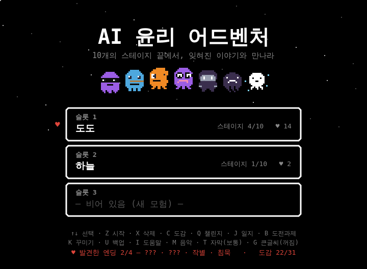 | 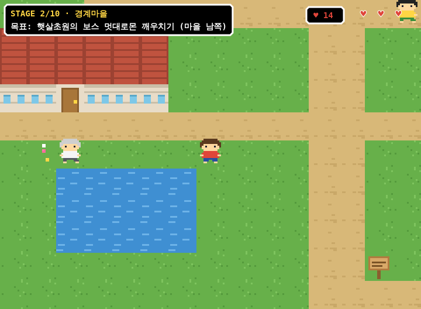 |

| 퀴즈 배틀 | 회피 미니게임 (보스전) |
|---|---|
| 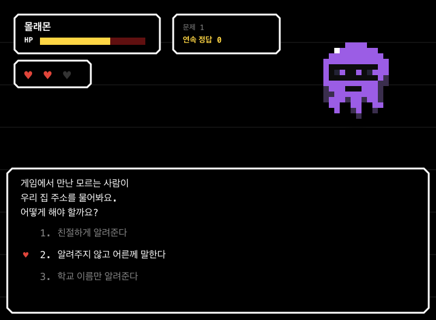 | 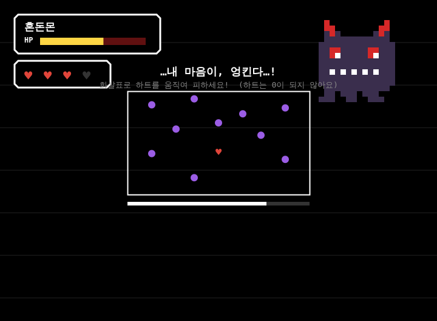 |

| 몬스터 도감 | 엔딩 |
|---|---|
| 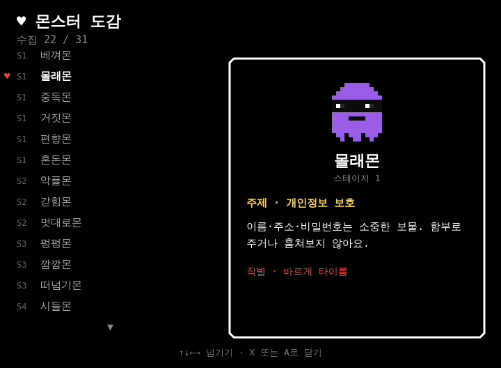 | 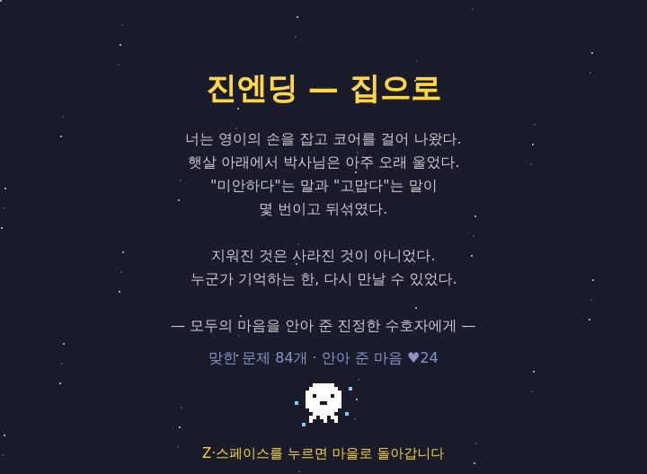 |

| 어두운 지역 (회로의 동굴) | 수호자 일지 (학습 진척도) |
|---|---|
| 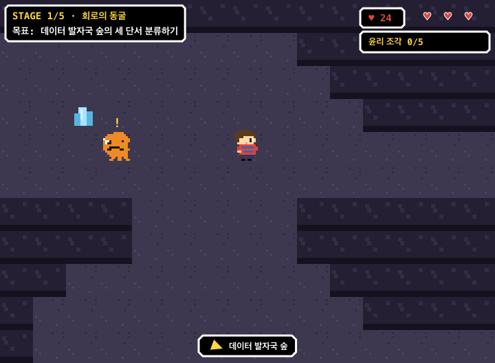 | 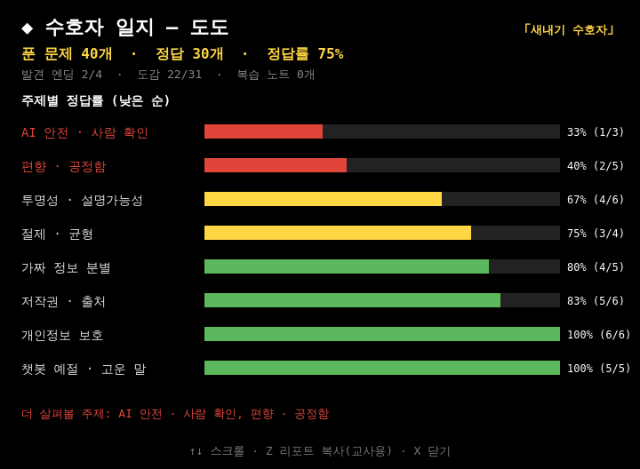 |

| 자유 퀴즈 챌린지 (오늘의 도전·맞춤 학습) | 도전과제 |
|---|---|
| 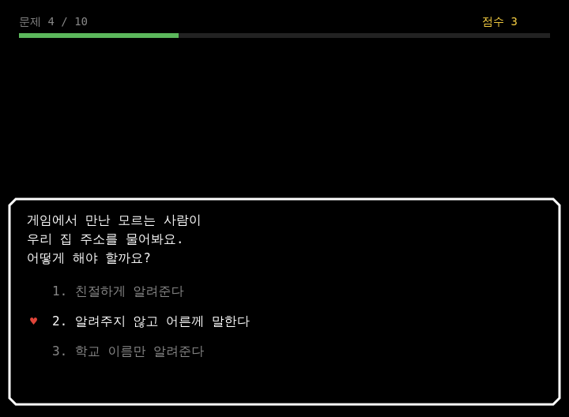 | 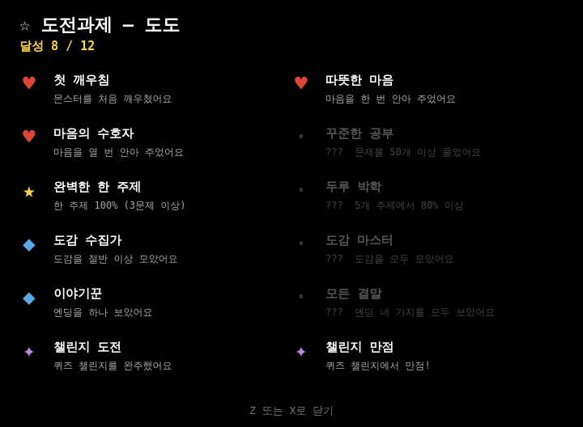 |

| 도움말 | 꾸미기 (칭호·테마) |
|---|---|
| 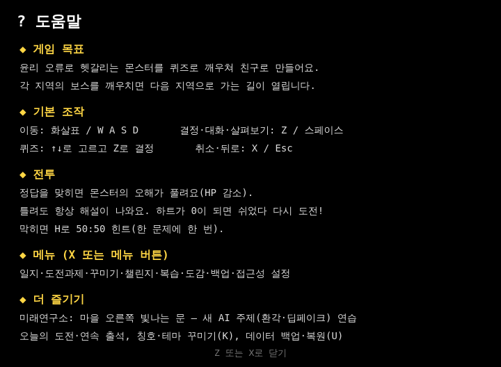 | 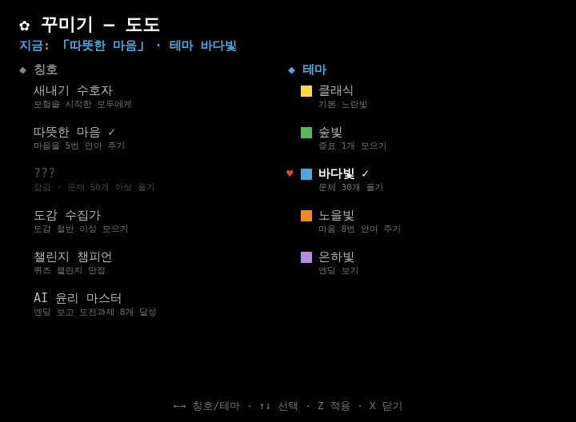 |

| 데이터 백업·복원 | 보너스 지역 — AI 미래연구소 |
|---|---|
| 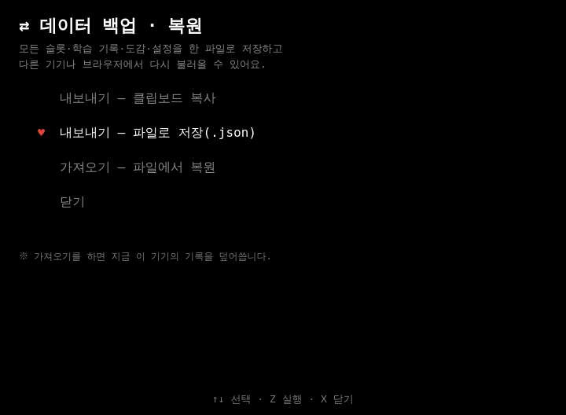 | 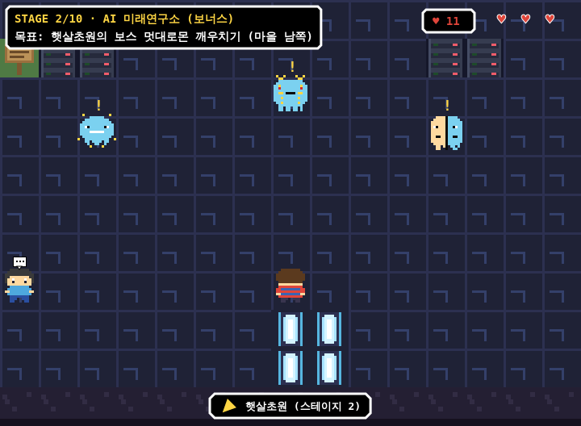 |

> 스크린샷은 `node tools/shots.js`로 실제 게임을 렌더해 자동 생성됩니다.
> (개발용 도구이며 `npm i`로 `canvas`를 한 번 설치해야 동작합니다.)

## 실행 방법

별도 설치가 필요 없습니다. 셋 중 편한 방법으로 실행하세요.

**방법 1 — 그냥 열기**

`index.html` 파일을 더블클릭해서 브라우저(크롬, 엣지 등)로 엽니다.

**방법 2 — 간단한 서버로 열기**

```bash
python3 -m http.server 8000
# 브라우저에서 http://localhost:8000 접속
```

**방법 3 — GitHub Pages로 배포 (교실 공유용)**

저장소 **Settings → Pages → Source**를 **"GitHub Actions"**로 한 번
설정해 두면, `main` 브랜치에 올라올 때마다 `.github/workflows/pages.yml`이
자동으로 사이트를 배포합니다. 학생들에게 URL 하나로 나눠 줄 수 있어요.

외부 라이브러리·이미지·음원 파일이 전혀 없는 순수 HTML5 Canvas + Web Audio
게임이라 저사양 PC, 태블릿에서도 가볍게 돌아갑니다.

## 모바일 / 태블릿

화면 아래에 **방향키 + A(결정) 버튼**, 위쪽에 **메뉴·도감 버튼**이 표시됩니다.
버튼은 크고 또렷하게(높은 대비·누름 효과·작은 안내 글자) 다듬어져 작은
화면에서도 누르기 쉽고, 안전 영역(노치)도 자동으로 피합니다. 세로로 들면
"가로로 돌려 주세요" 안내가 뜨고, 가로 화면에 맞춰 플레이하도록 설계돼
있습니다. (교실 태블릿 환경 권장)

터치 기기에는 키보드 단축키가 없으므로, 일지·도전과제·꾸미기·챌린지·
복습·도감·**데이터 백업**·접근성 설정 등 **모든 기능을 「메뉴」 버튼 → 메뉴**에서
열 수 있습니다.

**설치형 앱(PWA)** — 브라우저로 접속한 뒤 "홈 화면에 추가"를 하면
앱 아이콘으로 설치되고, 한 번 실행한 뒤에는 **네트워크 없이도** 동작합니다.
(GitHub Pages·HTTPS 환경에서 자동 적용. 교실 태블릿에 미리 한 번 열어 두면
인터넷이 끊겨도 수업이 가능합니다.)

## 조작 방법

| 동작 | 키 | 터치 |
|---|---|---|
| 이동 | 화살표 키 또는 W A S D | 방향 버튼 |
| 대화 / 결정 / 살펴보기 | Z, 스페이스, 엔터 | A 버튼 |
| 퀴즈·선택지 고르기 | ↑ ↓ 후 Z | 방향 + A |
| 회피 미니게임 | 화살표로 하트 이동 | 방향 버튼 |
| 몬스터 도감 열기 | C | 도감 버튼 |
| 설정·메뉴 열기 (마을/필드에서) | X, Esc | 메뉴 버튼 |
| 수호자 일지 (마을/필드·타이틀) | J | 메뉴 → 수호자 일지 |
| 도전과제 (마을/필드·타이틀) | B | 메뉴 → 도전과제 |
| 꾸미기: 칭호·테마 (마을/필드·타이틀) | K | 메뉴 → 꾸미기 |
| 자유 퀴즈 챌린지 (마을/필드·타이틀) | Q | 메뉴 → 퀴즈 챌린지 |
| 데이터 백업·복원 (마을/필드·타이틀) | U | 메뉴 → 데이터 백업·복원 |
| 오답 복습 노트 (마을/필드에서) | V | 메뉴 → 오답 복습 노트 |
| 도움말 (마을/필드·타이틀) | I | 메뉴 → 도움말 |
| 퀴즈 중 50:50 힌트 | H | 힌트 버튼 (퀴즈 화면에만 표시) |
| 취소 / 슬롯 삭제 | X, Esc | — |
| 음악 켜기/끄기 | M | 메뉴 → 소리 |
| 대화 자막 속도 (보통/빠름/느림) | T | 메뉴 → 자막 속도 |
| 큰 글씨 모드 (접근성) | G | 메뉴 → 큰 글씨 |
| 색약 모드 (접근성) | 메뉴에서 | 메뉴 → 색약 모드 |

> 터치 기기에는 단축키가 없으므로, 위 모든 기능을 **「메뉴」 버튼 → 메뉴**에서 열 수 있습니다.

## 세이브 슬롯

타이틀 화면에 **세이브 슬롯 3개**가 있습니다. 빈 슬롯을 고르면 이름을
지어 새 모험을 시작하고(여러 학생이 한 기기를 나눠 쓰기 좋아요), 채워진
슬롯은 이어서 진행합니다. 진행은 자동 저장되며, **X**로 슬롯을 삭제할 수
있습니다. 진행뿐 아니라 **학습 일지·복습 노트·도전과제·통계도 슬롯(=학생)
별로 따로** 보관되어, 한 기기를 나눠 써도 학생끼리 기록이 섞이지 않습니다.
(이전 버전의 단일 세이브와 전역 학습 데이터는 처음 실행 시 슬롯 1로 자동
이전됩니다.)

## 게임 흐름 — 전 5 스테이지

각 스테이지의 보스를 깨우쳐야 다음 지역으로 가는 길이 열립니다.

### 스테이지 1 — 경계마을 일대

박사님께 사명을 받고, 세 지역에서 마음의 증표를 모아 신호탑을 엽니다.

| 지역 | 몬스터 | 배우는 AI 윤리 주제 |
|---|---|---|
| 정적의 숲 | 베껴몬 | 저작권 존중, AI 사용 솔직하게 밝히기 |
| 정적의 숲 | 몰래몬 ⭐ | 개인정보 보호 |
| 잔향의 호수 | 중독몬 | AI·스마트폰의 건강한 사용과 절제 |
| 잔향의 호수 | 거짓몬 ⭐ | 딥페이크, 가짜뉴스 분별 |
| 회로의 동굴 | 편향몬 ⭐ | 알고리즘 편향과 공정성 |
| 신호탑 | 혼돈몬 👑 | 스테이지 1 종합 |

⭐ 수호자를 깨우치면 **마음의 증표**를 얻고, 증표 3개를 모으면 신호탑이 열립니다.

### 스테이지 2 — 햇살초원 (마을 남쪽)

| 몬스터 | 주제 |
|---|---|
| 악플몬 | 챗봇 예절, 사이버 언어폭력 |
| 갇힘몬 | 추천 알고리즘과 필터버블 |
| 멋대로몬 👑 | AI·로봇 안전, 사람의 확인(감독) |

### 스테이지 3 — 재깍사막

| 몬스터 | 주제 |
|---|---|
| 펑펑몬 | AI와 환경·에너지 (데이터센터) |
| 깜깜몬 | 투명성, 설명 가능한 AI |
| 떠넘기몬 👑 | AI 사용의 책임은 사람에게 |

### 스테이지 4 — 정지된 설원

| 몬스터 | 주제 |
|---|---|
| 시들몬 | 인간의 창의성과 노력의 가치 |
| 빼앗몬 | AI와 일자리, 사람과 AI의 협력 |
| 홀림몬 👑 | AI와 사람의 관계·감정 분별 |

### 스테이지 5 — 그림자성

| 몬스터 | 주제 |
|---|---|
| 메아리몬 | 스테이지 1 복습 시험 |
| 그림자몬 | 스테이지 2~3 복습 시험 |
| 어둠대왕몬 👑 | 전체 종합 최종 시험 |

어둠대왕몬을 이기면 **AI 윤리 수호자 인증서**(1차 엔딩)를 받습니다.
…그런데 왕좌 뒤의 벽에서, 낡은 신호가 아직 깜빡이고 있습니다.

### 심층부 — 스테이지 6~10 (1차 엔딩 이후)

분위기가 달라집니다. 글리치가 낀 지하 세계에서, 모든 윤리 오류
몬스터가 태어난 **진짜 이유**를 따라가는 스토리가 시작됩니다.
퀴즈도 고학년 눈높이로 한층 깊어집니다.

| 스테이지 | 지역 | 몬스터 | 주제 |
|---|---|---|---|
| 6 | 잊혀진 서버실 | 뚫림몬, 기록몬 👑 | 계정 보안·피싱 / 디지털 발자국·잊힐 권리 |
| 7 | 기억의 도서관 | 수집몬, 사서몬 👑 | 데이터 수집과 동의, 권한 |
| 8 | 거울 회랑 | 필터몬, 미러몬 👑 | 사칭·신원 도용 / AI 필터와 진짜 나 |
| 9 | 속삭임 정원 | 유혹몬, 속삭임몬 👑 | 다크패턴·설득 설계, 자동재생의 함정 |
| 10 | 코어 | 조각몬, ??? | 만든 것에 대한 책임, 존재의 가치 |

### 보너스 — AI 미래연구소 (본편과 무관, 언제든)

마을 오른쪽의 **빛나는 문**으로 들어가는 자유 연습 공간입니다. 증표나 자비와
상관없이 언제든 드나들 수 있고, 아직 교과서에 다 담기지 않은 **새로운 AI
주제**를 미리 만나 봅니다. 여기서 친구가 된 몬스터도 도감·도전과제에 함께
기록돼요.

| 몬스터 | 주제 |
|---|---|
| 환각몬 | 생성형 AI 비판적 사용 — 그럴듯한 거짓(환각) 확인하기 |
| 합성몬 | 딥페이크·합성 미디어 분별 |
| 미래몬 | 위 두 주제 종합 |

## ♥ 마음의 선택 (자비 시스템)

스테이지 1의 첫 몬스터부터, 모든 전투는 퀴즈를 맞히는 것으로 끝나지
않습니다. 마지막 순간 그 몬스터를 **어떻게 대할지** 세 가지 선택이
나오고, 따뜻한 선택은 ♥로 조용히 기록됩니다. (화면 오른쪽 위에 표시)

> "정답을 맞히는 것만큼이나, 어떻게 작별하는지가 중요해." — 할머니

## 엔딩 — 4가지 결말

여정 전체의 ♥와 마지막 순간의 선택에 따라 결말이 갈립니다.
발견한 엔딩은 타이틀 화면에 수집됩니다. (새로 시작해도 남아요)

| 엔딩 | 조건 (대략적인 힌트) |
|---|---|
| 진엔딩 「집으로」 | 거의 모두의 마음을 안아 주고, 마지막에 손을 내밀기 |
| 「새벽」 | 충분히 따뜻한 여정 끝에, 그 아이 스스로 결정하게 하기 |
| 「작별」 | 그 외의 따뜻한 여정 |
| 「침묵」 | 정답만 말하고, 아무의 마음에도 머물지 않기 |

스테이지 5 클리어 시의 **수호자 인증서**는 중간 엔딩으로 따로
주어지며, 이야기는 그 뒤로 이어집니다.

배틀에서 정답을 맞히면 몬스터의 오해가 풀리고(HP 감소), 틀리면 하트를
잃지만 **틀려도 항상 친절한 해설**을 보여줘서 자연스럽게 배우게 됩니다.
패배해도 벌칙 없이 바로 다시 도전할 수 있어요.

## 회피 미니게임 (보스전)

보스의 HP가 절반으로 떨어지는 순간, 그 마음이 **폭주**하며 짧은
**회피 구간**이 펼쳐집니다. 화살표로 하트(소울)를 움직여 탄막을
피하세요. 단, **하트는 0이 되지 않아** 게임오버가 없으니 어린이도
부담 없이 즐길 수 있습니다.

## 몬스터 도감

깨우친 몬스터는 **도감(C 키/도감 버튼)**에 기록됩니다. 각 몬스터의
AI 윤리 주제와 배운 점, 내가 한 작별 선택까지 남아요. 도감 수집은
세이브와 별개로 누적 보존되어, 복습 도구이자 수집 재미가 됩니다.

## 오답 복습 노트

퀴즈를 틀리면 그 문제가 **복습 노트**에 자동으로 기록됩니다. 마을/필드에서
**V 키**(또는 설정 메뉴)로 열어 목록에서 문제를 골라 다시 풀 수 있고,
맞히면 노트에서 사라집니다. 세이브와 별개로 누적 보존되어, 한 슬롯에서
어려웠던 문제를 따로 모아 복습하는 용도로 쓸 수 있습니다.

## 설정·일시정지 메뉴

마을/필드에서 **X(Esc)**를 누르면 설정 메뉴가 열립니다. 수호자 일지,
오답 복습 노트, 몬스터 도감 바로가기와 함께, **자막 속도**·**큰 글씨 모드**·
**음소거**를 한곳에서 켜고 끌 수 있습니다. (이전에는 T/G/M 키로만 접근
가능했던 기능들이 이제 메뉴로도 제공됩니다)

## 수호자 일지 (학습 진척도) · 학생별 기록

**J 키**(또는 메뉴)로 여는 **수호자 일지**는, 그동안 푼 퀴즈의
**주제별 정답률**을 막대그래프로 보여 줍니다. 정답률이 낮은 주제가 위로
올라오고 색으로 강조되어, 무엇을 더 살펴봐야 하는지 한눈에 보입니다.
전체 정답률·발견 엔딩·도감 수집률·복습 노트 잔여 문제 수도 함께 표시돼요.

일지·복습 노트·도전과제·통계는 **세이브 슬롯(=학생)별로 따로** 누적됩니다.
한 태블릿을 여러 학생이 슬롯으로 나눠 써도 학습 기록이 섞이지 않고,
슬롯을 삭제하면 그 학생의 학습 기록도 함께 정리됩니다. (도감·발견 엔딩은
기기 공용 컬렉션으로 그대로 둡니다.)

### 교실용 학습 리포트

수호자 일지에서 **Z 키**를 누르면, 그 학생의 학습 데이터를 정리한
**텍스트 리포트**가 클립보드에 복사됩니다. 이름·날짜·전체 정답률·주제별
정답률·더 살펴볼 주제·엔딩/도감 수집 현황이 한 장으로 담겨, 교사·학부모가
학생의 학습 상태를 빠르게 파악하거나 기록으로 붙여 넣기 좋습니다.

## 도전과제 (업적)

**B 키**(또는 메뉴)로 여는 **도전과제** 화면에서, 학습·전투·수집·챌린지
영역의 목표 12가지를 배지로 모읍니다. (예: *첫 깨우침, 마음의 수호자,
완벽한 한 주제, 두루 박학, 도감 마스터, 모든 결말, 챌린지 만점 …*)
달성 여부는 그 학생의 학습 데이터에서 자동으로 판정되어, 다음 목표가
자연스럽게 동기 부여가 됩니다.

## 자유 퀴즈 챌린지 (오늘의 도전 · 맞춤 학습 포함)

타이틀이나 마을/필드에서 **Q 키**(또는 메뉴)로, 어드벤처와 별개로 즐기는
**퀴즈 챌린지 모드**가 열립니다. 다음 중에서 골라 10문제에 도전하고,
마지막에 점수와 격려 메시지를 받습니다. 틀린 문제는 복습 노트에, 결과는
수호자 일지 통계에 함께 반영됩니다.

- **◷ 오늘의 도전** — 날짜를 씨앗으로 문제가 정해져, **같은 날에는 모두 같은
  문제**를 풉니다. 완료하면 그날의 출석이 기록돼 **연속 출석(스트릭)**이 쌓여요.
- **◎ 맞춤 학습 (약점 집중)** — 그 학생이 **틀렸던 문제와 정답률이 낮은
  주제**를 우선해서 출제하는 적응형 모드입니다.
- **★ 전체 랜덤** 또는 특정 **주제** — 원하는 범위로 자유롭게 연습.

수업 도입부 워밍업, 마무리 복습, 매일 한 판의 습관 만들기에 알맞아요.

## 오늘의 도전 · 연속 출석(스트릭)

이 슬롯으로 논 날이 **하루도 안 빠지고 이어지면** 연속 출석(🔥)이 늘어납니다.
타이틀의 슬롯과 수호자 일지·교실 리포트에 현재/최고 연속 출석이 표시되어,
꾸준히 조금씩 공부하는 습관을 자연스럽게 응원합니다.

## 적응형(맞춤) 학습

챌린지의 **맞춤 학습** 모드는 그 학생의 학습 데이터를 활용합니다. 복습
노트(이전에 틀린 문제)를 먼저 채우고, 남은 자리는 **정답률이 낮거나 아직
풀지 않은 주제**일수록 더 자주 뽑아 약점을 집중적으로 메워 줍니다.

## 꾸미기 (칭호 · 테마)

**K 키**(또는 메뉴)로 여는 **꾸미기** 화면에서, 학습·수집 성취로 **칭호**와
화면 강조색 **테마**를 모아 골라 끼울 수 있습니다. (예: *따뜻한 마음,
공부벌레, 도감 수집가, 챌린지 챔피언* 칭호 / *숲빛·바다빛·노을빛·은하빛*
테마) 고른 칭호는 일지와 교실 리포트에, 테마색은 화면 곳곳의 강조색에
반영됩니다. 새 보상이 열리면 모험 중에 살짝 알림이 떠요. 칭호·테마는
학생(슬롯)별로 따로 보관됩니다.

## 데이터 백업 · 복원

**U 키**(또는 메뉴 → 데이터 백업·복원)로, **모든 슬롯·학습 기록·복습 노트·
도감·도전과제·꾸미기·설정**을 한 파일로 모아 둘 수 있습니다.

- **내보내기** — 클립보드로 복사하거나 `.json` 파일로 저장.
- **가져오기** — 저장해 둔 파일을 골라 **다른 기기·브라우저로 그대로 옮기거나
  복원**. (가져오면 지금 기기의 기록을 덮어씁니다.)

기기를 바꾸거나 브라우저 데이터가 지워져도 진행과 학습 기록을 지킬 수 있어,
교실에서 학생 데이터를 백업·이관하기에 좋습니다.

## 50:50 힌트

퀴즈 화면에서 **H 키**(또는 H 버튼)를 누르면, 오답 보기 중 하나가
흐리게 표시되며 선택할 수 없게 됩니다. 한 문제당 한 번만 사용할 수
있고, 어려운 문제에서 막힌 학생을 위한 배려 기능입니다.

## 접근성 (큰 글씨 · 색약 모드 · 도움말)

- **큰 글씨(G)**: 대화·퀴즈 등 읽기 화면의 글자와 줄간격을 키웁니다.
- **색약 모드**: 정답률 막대·정답/오답 표시의 색을 빨강/초록 대신 구분이
  쉬운 파랑/주황(Okabe–Ito 계열)으로 바꿉니다. 색뿐 아니라 ○/× 기호와
  소리로도 결과를 알려, 색 구분이 어려워도 문제없이 즐길 수 있어요.
- **도움말(I)**: 게임 목표·조작·전투·메뉴를 한 화면으로 안내합니다.
  처음 시작한 학생에게는 **첫 전투에서 한 번** 간단한 전투 안내도 떠요.

색약 모드는 게임 중 **X(메뉴)** 안에서 켜고 끌 수 있고, 자막 속도·큰 글씨와
함께 세이브와 별개로 저장됩니다.

## 설치형 앱(PWA)·오프라인

`manifest.webmanifest` + `sw.js`(서비스워커)로 **앱 설치와 오프라인 실행**을
지원합니다. HTTPS(예: GitHub Pages)로 한 번 접속하면 모든 게임 파일이
캐시되어, 이후에는 인터넷 없이도 동작합니다. 브라우저의 "홈 화면에 추가"로
전체화면 앱처럼 설치할 수 있어, 교실 태블릿 배포에 적합합니다.
아이콘은 `node tools/icons.js`로 생성합니다.

## 살펴보기

어디서나 **Z(또는 A 버튼)**으로 주변을 살펴볼 수 있습니다. 나무·물·
책장·거울 같은 사물마다 한 줄 설명이 있고, 특별한 지점에는 이야기의
복선이 숨어 있습니다. (예: 정원의 "영이가 심은 화분")

## 프로젝트 구조

```
index.html        진입점 (반응형 터치 컨트롤, 이름 입력 오버레이, 가로 안내, PWA 등록)
manifest.webmanifest  PWA 설치 정보 (이름·아이콘·전체화면·가로 고정)
sw.js             서비스워커 (정적 자원 캐시 → 오프라인 실행)
icons/            앱 아이콘 (192/512/maskable/apple-touch, tools/icons.js로 생성)
src/sprites.js    도트 스프라이트 (문자 맵 기반 픽셀 아트, 몬스터 31종)
src/audio.js      칩튠 BGM 11곡 + 효과음 (Web Audio API)
src/data.js       맵 15개, NPC, 몬스터, 퀴즈, 도감, 보스 공격, 조사 텍스트, 대사
src/game.js       게임 엔진 (이동·대화·배틀·회피·도감·자비·4종 엔딩·슬롯·일지·복습·챌린지·도전과제·접근성·꾸미기·백업·일일도전·도움말)
tools/validate.js 데이터 검증 (맵 너비, 워프, 도달 가능성, 박자, 도감, 조사 지점)
tools/smoketest.js 플레이 경로 자동 테스트 (진엔딩까지 시뮬레이션, 170개 검사)
tools/slottest.js  세이브 슬롯·마이그레이션 테스트 (20개 검사)
tools/shots.js     스크린샷 생성기 · tools/icons.js  앱 아이콘 생성기 (node-canvas)
.github/workflows/pages.yml  GitHub Pages 자동 배포
```

## 개발자용 검사

```bash
node tools/validate.js   # 데이터 무결성 검사
node tools/smoketest.js  # 게임 로직 스모크 테스트 (플레이 경로)
node tools/slottest.js   # 세이브 슬롯 시스템 테스트
```

## 퀴즈 수정·추가하기

`src/data.js`의 `QUIZZES`에 문항을 추가하면 됩니다.

```js
{
  q: '문제 (줄바꿈은 \n)',
  a: ['보기1', '보기2', '보기3'],
  c: 1,            // 정답 번호 (0부터)
  why: '해설 (정답이든 오답이든 항상 표시됩니다)',
}
```
