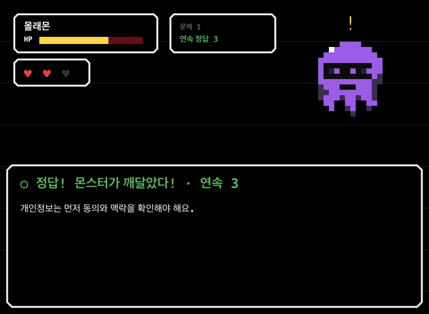
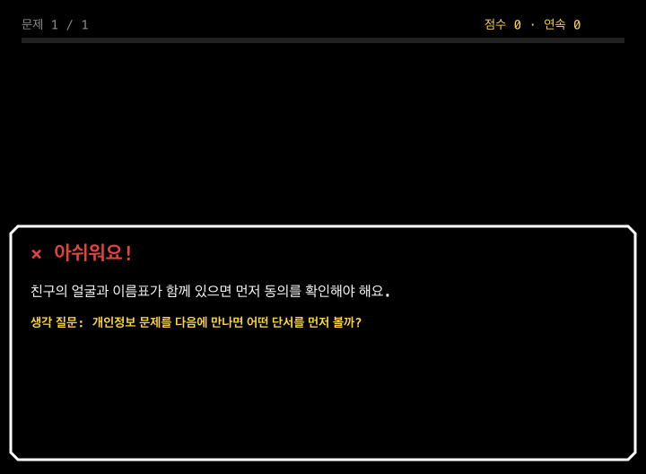
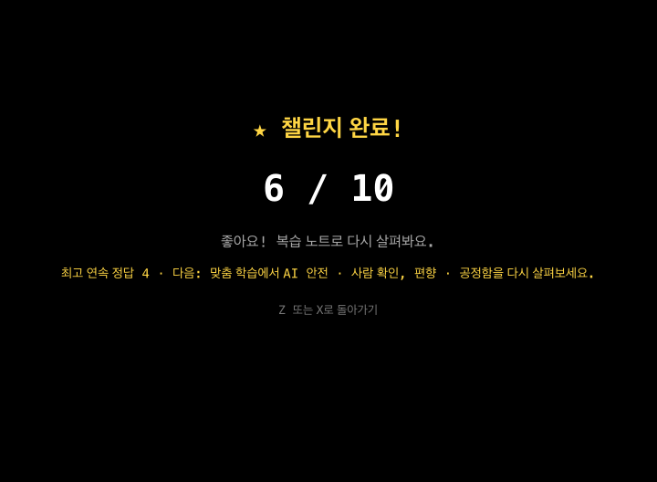
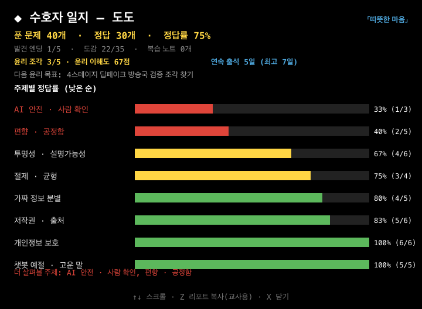
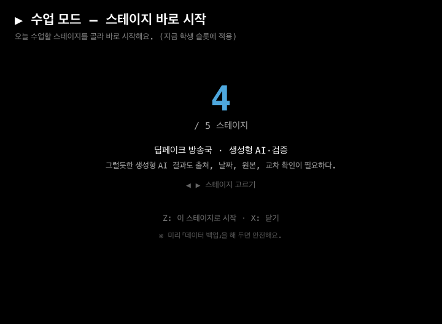
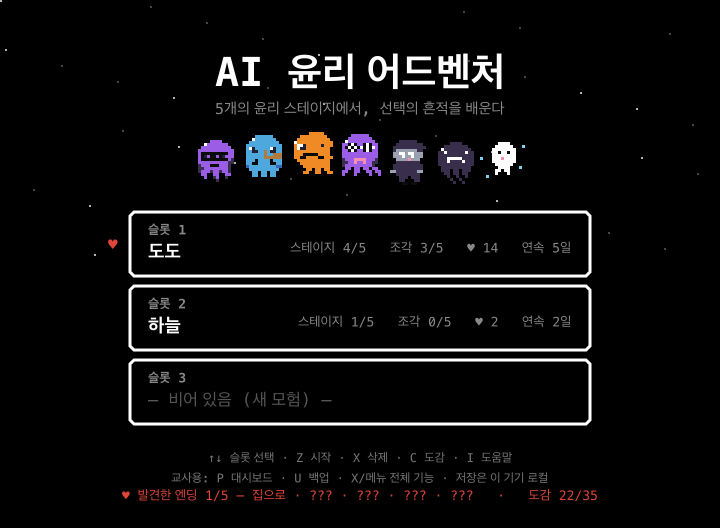

# AI 윤리 어드벤처 50회 개발 사이클 요청 보고서

작성일: 2026-06-26

## 실행 결과

기존 10회 사이클 보고서(`reports/2026-06-26-development-cycles.md`) 이후, 같은 지적을 반복하지 않고 추가 검토-개발 사이클을 이어 갔다. 50회까지 강제로 채우지 않고, 중복 없는 고효과 개발 과제가 소진된 25번째 사이클에서 중지했다. 26번째부터는 새 스토리/맵/대형 콘텐츠 기획 또는 서버 저장 같은 별도 범위가 필요해, 현재 정적 Canvas 게임의 품질 개선 사이클로는 반복 지적이 된다고 판단했다.

## 사이클별 디벨롭 요약

| 사이클 | 검토 관점 | 새로 찾은 개발 지점 | 실제 디벨롭 내용 | 증거 |
|---:|---|---|---|---|
| 1~10 | 이전 보고서 | 회고 질문, 윤리 축 히트맵, CSV, HUD 진행도 | 기존 10회 사이클 완료 | [10회 보고서](2026-06-26-development-cycles.md) |
| 11 | 전투 재미 | 정답을 맞혀도 즉시 숙련감이 약함 | 전투에 `연속 정답` 콤보 상태와 화면 패널을 추가 | [전투 연속 정답](../shots/28-battle-combo.png) |
| 12 | 전투 피드백 | 정답 피드백이 단발성으로 끝남 | 정답 피드백 제목에 연속 정답 수를 함께 표시 | [전투 연속 정답](../shots/28-battle-combo.png) |
| 13 | 선택 결과 | 마음의 선택이 어떤 윤리 축을 키웠는지 즉시 보이지 않음 | 승리 대화에 `[선택의 흔적]`과 윤리 축 증가량을 추가 | 테스트: `마음 선택 보상 문구` |
| 14 | 접근성 | TTS가 오답 회고 질문을 읽지 않음 | 읽어주기 피드백에 회고 프롬프트까지 포함 | 테스트: `챌린지 오답에 생각 질문 포함` |
| 15 | 챌린지 재미 | 자유 퀴즈가 점수만 보여 반복 동기가 약함 | 챌린지에도 연속 정답/최고 연속 정답을 추가 | [챌린지 다음 학습](../shots/30-challenge-next-step.png) |
| 16 | 챌린지 학습성 | 챌린지 오답은 해설 뒤 복습 연결이 약함 | 챌린지 오답에 생각 질문을 추가 | [챌린지 회고](../shots/29-challenge-reflection.png) |
| 17 | 복습 동선 | 챌린지 결과 뒤 무엇을 해야 할지 불명확함 | 결과 화면에 복습 노트/맞춤 학습/전체 랜덤 추천을 표시 | [챌린지 다음 학습](../shots/30-challenge-next-step.png) |
| 18 | 학생 자기점검 | 일지에서 윤리 조각과 윤리 이해도가 빠짐 | 수호자 일지 상단에 윤리 조각 n/5와 이해도 점수를 추가 | [일지 윤리 요약](../shots/31-journal-ethics-summary.png) |
| 19 | 복귀 동기 | 타이틀 슬롯에서 다음 목표가 약함 | 저장 슬롯 요약에 윤리 조각 진행도를 추가 | [타이틀 조각 진행](../shots/33-title-puzzle-pieces.png) |
| 20 | 수업 운영 | 수업 모드 설명이 현재 5스테이지 윤리 축 구조와 불일치 | 스테이지명·윤리 축·핵심 배움 문장을 수업 모드에 표시 | [수업 모드 테마](../shots/32-classmode-stage-theme.png) |
| 21 | 게임 보상 | 윤리 조각 완주가 업적으로 인정되지 않음 | `윤리 조각 수집가` 도전과제와 칭호 조건 추가 | 테스트: `윤리 조각 도전과제 조건 달성` |
| 22 | 교육 보상 | 5개 윤리 축을 고르게 키우는 행동이 보상되지 않음 | `균형 잡힌 수호자` 도전과제와 `균형 수호자` 칭호 추가 | 테스트: `새 윤리 보상 포함` |
| 23 | 꾸미기 보상 | 퍼즐 완주 보상이 꾸미기와 연결되지 않음 | 윤리 조각 5개 수집 시 `조각빛` 테마 해금 | 테스트: `새 윤리 보상 포함` |
| 24 | 문서/접근성 | 새 흐름이 README·교사용 안내·스크린리더 문구에 반영되지 않음 | README, 교사용 안내서, 접근성 상태 문구를 갱신 | [README](../README.md) |
| 25 | 코드리뷰 | 타이틀 슬롯의 조각 수가 현재 메모리 플래그에 오염될 수 있음 | 슬롯 목록 화면은 저장 슬롯 플래그를 읽고, 플레이 중에는 메모리 플래그를 읽도록 분리 | 테스트: `타이틀 슬롯 표시는 저장 슬롯 플래그 사용` |
| 26 | 중지 판단 | 남은 후보가 새 콘텐츠 제작 또는 대형 시스템 범위로 넘어감 | 현재 요청 범위의 중복 없는 고효과 개발 사이클 중지 | 이 보고서 |

## 핵심 스크린샷

### 전투 연속 정답

### 챌린지 오답 회고

### 챌린지 다음 학습 추천

### 수호자 일지 윤리 요약

### 수업 모드 스테이지 테마

### 타이틀 슬롯 윤리 조각

## 코드리뷰 메모

- 새 기능 추가 중 `slotFlags()`가 타이틀/교사용 표시에 현재 메모리 상태를 섞을 수 있는 버그를 발견했다.
- 저장 슬롯 목록을 보는 화면과 실제 플레이 중 화면의 데이터 출처를 분리했고, 회귀 테스트를 추가했다.
- 이번 추가 사이클에서 새 외부 런타임 의존성은 만들지 않았다. 기존 개발 의존성 `canvas`는 스크린샷 생성용이다.

## 검증

- `node --check src/game.js && node --check tools/smoketest.js && node --check tools/shots.js`
- `npm run validate` — 문서/스크린샷/패키징 메타 검사 통과
- `npm test` — smoke 393개 검사, slot 25개 검사 통과
- `npm run test:browser` — 브라우저 스모크 테스트 통과
- `npm run shots` — 33장 스크린샷 생성
- `npm run test:pack` — 오프라인 ZIP 생성 및 내용 검사 통과
- `git diff --check` — 공백 오류 없음
