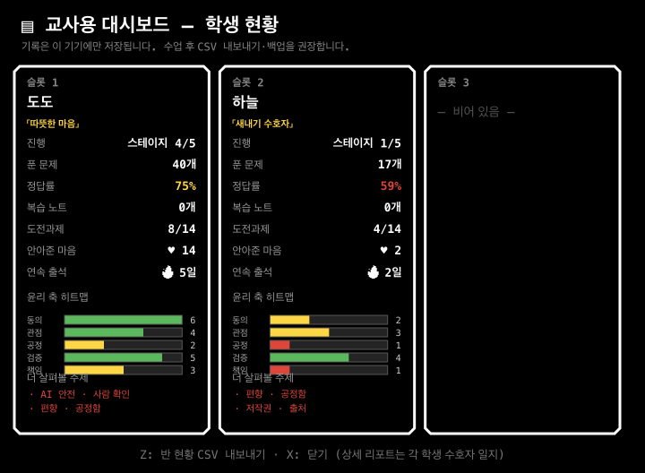
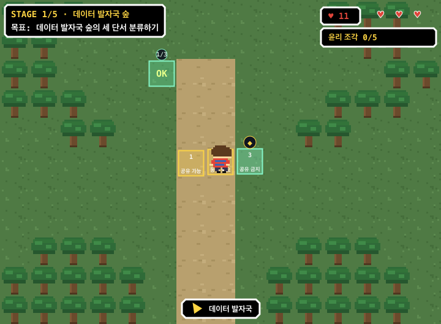
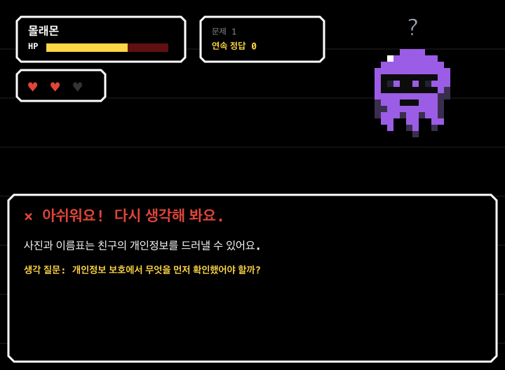
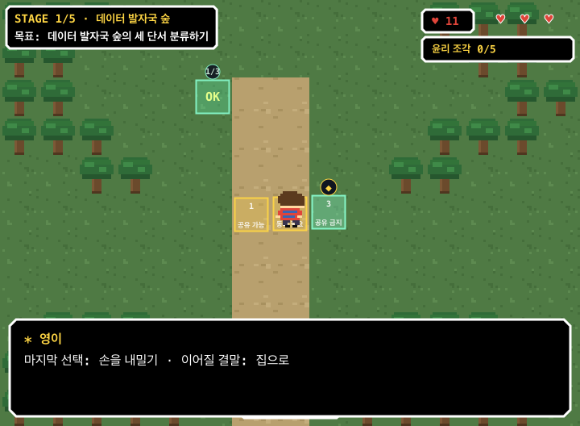
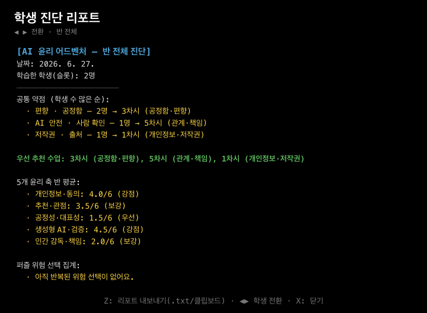
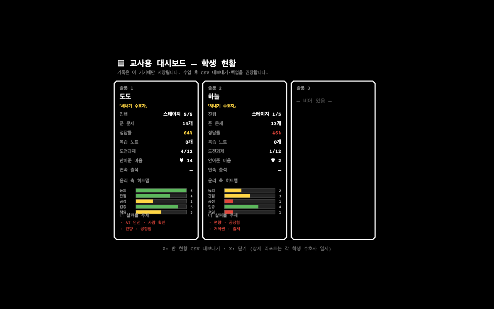
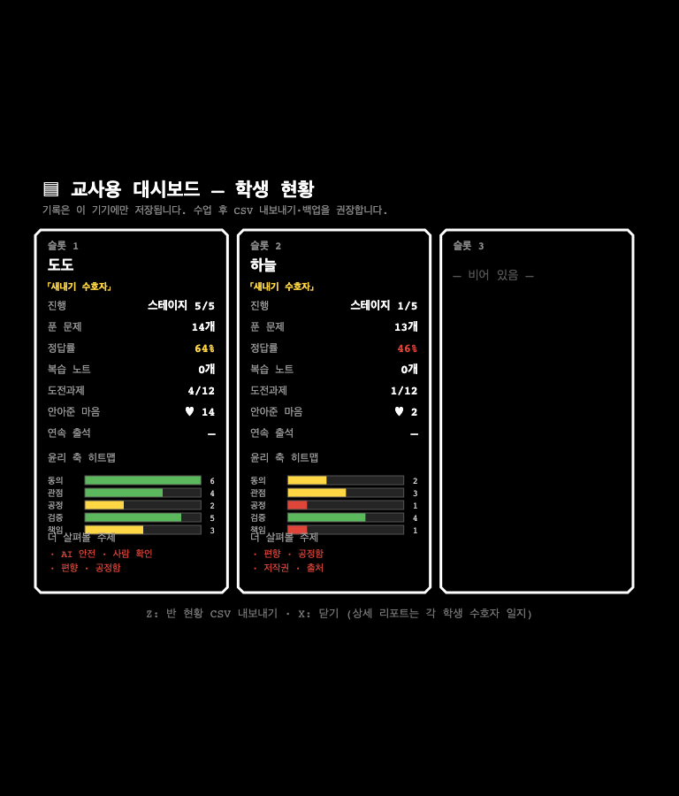
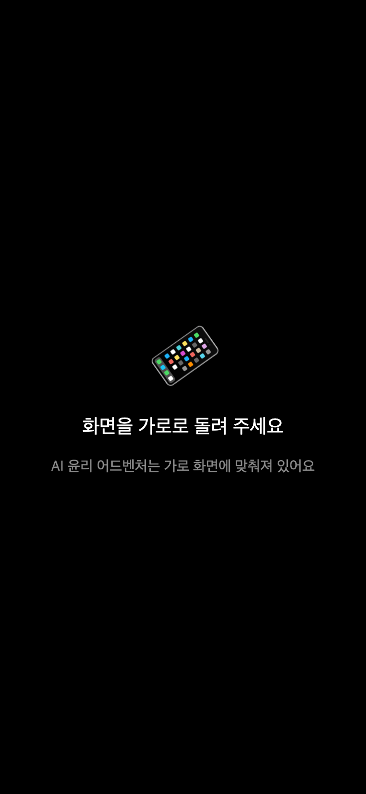

# AI 윤리 어드벤처 추가 디벨롭 10회 사이클 보고서

작성일: 2026-06-26

## 요약

실사용자 관점, 교수학적 관점, 게임 재미 요소를 기준으로 10회 점검-개발 사이클을 돌렸다. 이전 사이클에서 이미 다룬 지적은 다음 사이클에서 반복하지 않고, 새로 발견한 개발 지점만 반영했다.

| 사이클 | 검토 관점 | 새로 찾은 개발 지점 | 실제 디벨롭 내용 | 증거 |
|---:|---|---|---|---|
| 1 | 멀티 엔딩 학습성 | 결말이 선택과 윤리 축에서 나온다는 설명이 부족함 | 진엔딩 직전 `[마지막 회고]` 대화를 추가해 마지막 선택, 이어질 결말, 윤리 이해도, 마음 수치를 보여 줌 | [엔딩 회고](../shots/26-ending-reflection.png) |
| 2 | 오답 후 학습 전환 | 전투 오답이 해설 읽기로 끝나 자기 설명이 약함 | 오답 피드백에 `생각 질문`을 추가해 학생이 무엇을 먼저 확인했어야 했는지 말하게 함 | [오답 회고](../shots/25-feedback-reflection.png) |
| 3 | 퍼즐 오분류 회복 | 퍼즐에서 틀린 분류가 왜 틀렸는지 말로 회수되지 않음 | 퍼즐 오분류 뒤 윤리 축 관점의 자기 설명 질문을 대화에 추가함 | 테스트: `오분류 뒤 자기 설명 질문` |
| 4 | 교사용 진단성 | 학생별 윤리 축 차이가 정답률만으로 보이지 않음 | 교사용 대시보드에 5개 윤리 축 히트맵 막대를 추가함 | [대시보드](../shots/17-dashboard.png) |
| 5 | 반 전체 수업 설계 | 반 공통 약점은 보이지만 큰 윤리 축 평균이 없음 | 반 전체 진단 리포트에 5개 윤리 축 평균과 우선/보강/강점 표시를 추가함 | [반 전체 진단](../shots/27-class-report-heatmap.png) |
| 6 | 기록/내보내기 | CSV가 문항 성취만 남기고 윤리 축 점수를 잃음 | 반 현황 CSV에 5개 윤리 축 점수 컬럼을 추가하고 빈 슬롯 행도 17열 구조를 유지하게 함 | 테스트: `CSV 헤더 17개 열`, `CSV 빈 슬롯 행도 17개 열 유지` |
| 7 | 게임 목표감 | 학생이 스테이지 퍼즐을 왜 모으는지 HUD에서 약함 | 월드 HUD에 `윤리 조각 n/5` 카운터를 추가함 | [퍼즐 진행 화면](../shots/24-puzzle-progress.png) |
| 8 | 퍼즐 몰입도 | 현재 퍼즐에서 단서가 몇 개 남았는지 즉시 알기 어려움 | 모든 스테이지 퍼즐 화면에 `단서 n/전체` 진행 표시를 추가함 | [퍼즐 진행 화면](../shots/24-puzzle-progress.png) |
| 9 | 학습 리포트 해석 | 엔딩 수집은 보이지만 마지막 결말의 의미가 리포트에 남지 않음 | 수호자 일지 텍스트 리포트에 마지막 결말 회고 한 줄을 추가함 | 테스트: `리포트에 마지막 결말 회고 포함` |
| 10 | 시각 QA와 보고 | 개발 결과를 교사용 검토 자료로 남길 고정 산출물이 없음 | 27장 화면 샷과 Chromium 반응형 대시보드 샷을 재생성하고 이 보고서를 저장함 | [데스크톱](screenshots/dashboard-desktop.png), [태블릿](screenshots/dashboard-tablet.png), [모바일](screenshots/dashboard-mobile.png) |

## 핵심 스크린샷

### 교사용 대시보드 히트맵

### 퍼즐 진행도와 윤리 조각 HUD

### 오답 자기 설명 프롬프트

### 엔딩 직전 선택 회고

### 반 전체 진단의 윤리 축 평균

### Chromium 반응형 확인

## 검증

- `node --check src/game.js && node --check tools/smoketest.js && node --check tools/shots.js`
- `npm run validate`
- `npm test`
- `npm run test:browser`
- `npm run shots`

## 더 이상 이번 사이클에서 진행하지 않은 것

- 새 아이템 시스템은 프로젝트 지침에서 아직 추가하지 말라고 명시되어 있어 제외했다.
- 백엔드, 로그인, 서버 저장은 정적 배포 모델을 깨므로 제외했다.
