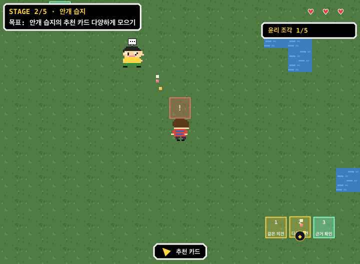
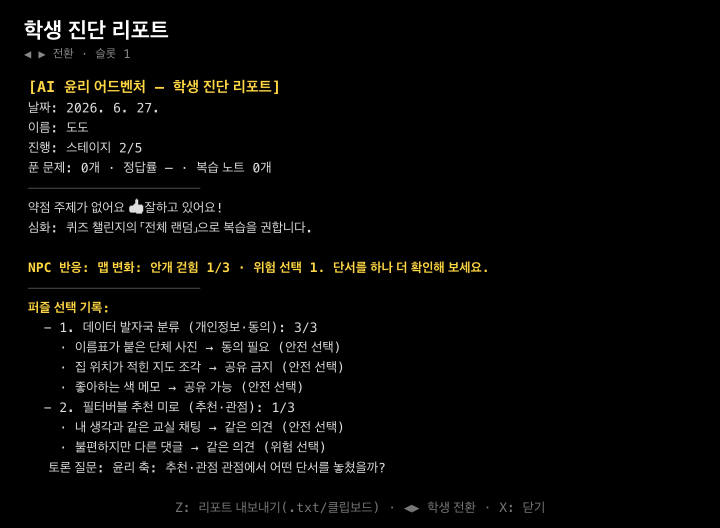

# 2026-06-27 명확화 1~6 과제 50회기 보고

## 결론

로컬 개발 가능 범위에서는 1, 2, 3, 4, 6번을 구현·검증했다. 5번의 원격 GitHub Actions, 실제 배포 URL, 학교 태블릿/노트북 QA, 스크린리더 수동 확인은 실제 외부 환경 증거가 필요하므로 출시 게이트에서 실패 상태로 남겼다. Lighthouse 모바일/데스크톱 감사는 실제 Chrome 기반으로 생성했고 기준을 통과했다.

게이트 리뷰에서 “선택 결과 오버레이일 뿐 실제 맵 조작 퍼즐이 아니다”와 “틀렸다가 고친 위험 선택이 리포트에서 사라진다”는 BLOCK을 받았고, 후속 수정으로 단서를 월드에서 들고 발판에 놓는 흐름과 `attempts` 기반 위험 선택 기록을 추가했다.

## 대표 증거

| 증거 | 파일 |
|---|---|
| 맵 조작 퍼즐: 단서 발판 1/2/3, 위험 선택 !, 진행 1/3 표시 | [shots/34-puzzle-map-effect.png](../shots/34-puzzle-map-effect.png) |
| 교사용 학생 진단: 퍼즐 선택 기록, 위험 선택, 토론 질문 | [shots/35-puzzle-choice-report.png](../shots/35-puzzle-choice-report.png) |
| Lighthouse 모바일 JSON | [reports/audits/lighthouse-mobile.json](audits/lighthouse-mobile.json) |
| Lighthouse 데스크톱 JSON | [reports/audits/lighthouse-desktop.json](audits/lighthouse-desktop.json) |
| 출시 검증 게이트 문서 | [docs/release-verification-gate.md](../docs/release-verification-gate.md) |

## Lighthouse 결과

| 대상 | Performance | Accessibility | Best Practices | SEO |
|---|---:|---:|---:|---:|
| 모바일 | 80 | 93 | 100 | 100 |
| 데스크톱 | 99 | 90 | 100 | 100 |

## 50회기 요약

| 회기 | 검토 관점 | 개발/검증 내용 | 결과 |
|---:|---|---|---|
| 1 | 요구 재정렬 | 사용자가 지정한 1~6번 과제를 기존 반복 개선 목록과 분리 | 범위 확정 |
| 2 | 리뷰 에이전트 | 기존 코드가 선택창 중심이고 리포트 선택 기록이 부족하다는 BLOCK 수집 | 수정 대상 확정 |
| 3 | 디벨롭 에이전트 | `npm test` 실패 지점과 누락 export 확인 | RED 조건 확보 |
| 4 | RED 테스트 | 맵 변화 문구, 선택 기록, 위험 선택, 토론 질문, NPC 반응 테스트 추가 | 실패 조건 고정 |
| 5 | 퍼즐 축 | 위험 선택 토론 질문이 실제 퍼즐 축을 쓰도록 `ethicsAxisLine` 추가 | 축 오분류 방지 |
| 6 | 맵 조작 | 단서를 월드에서 들고 지도 발판에 놓아 선택하게 변경 | 선택창 중심 제거 |
| 7 | 맵 효과 | 퍼즐 선택 상태를 단서 타일 위 `OK/!` 오버레이로 표시 | 선택이 지도에 남음 |
| 8 | 학생 리포트 | 진단 리포트에 퍼즐 선택 기록과 위험 선택 추가 | 교사용 피드백 강화 |
| 9 | 학습 리포트 | 수호자 일지 복사 리포트에도 퍼즐 선택 기록 추가 | 학부모/교사용 텍스트 보강 |
| 10 | 반 리포트 | 반 전체 진단에 반복 위험 선택 집계 추가 | 수업 토론 주제 도출 |
| 11 | NPC 단서 | 진행도별 NPC 반응 문구를 리포트/테스트 훅에 연결 | 퍼즐 전후 맥락 강화 |
| 12 | 테스트 훅 | 새 헬퍼를 `window.__test`에 export | 자동 검증 가능 |
| 13 | 단위 검증 | `npm test` 실행 | 409개 스모크, 25개 슬롯 통과 |
| 14 | README 증거 | 퍼즐맵/퍼즐 리포트 스크린샷을 README 첫 화면 목록에 추가 | 공모전 자료성 강화 |
| 15 | 스크린샷 생성 | `tools/shots.js`에 34/35번 산출물 추가 | 재생성 가능 |
| 16 | 시각 QA 1 | 34번 첫 이미지가 스테이지 목표를 잘못 보이는 문제 발견 | 시드 수정 |
| 17 | 시각 QA 2 | 안전 선택 OK가 HUD에 가려지는 문제 발견 | 카메라 수정 |
| 18 | 시각 QA 3 | 35번 리포트가 하단 안내와 붙는 문제 발견 | 통계 시드 정리 |
| 19 | 최종 스크린샷 | 34/35번 재생성 후 직접 확인 | 대표 증거 확정 |
| 20 | 출시 게이트 | `tools/release-gate.js` 추가 | 외부 증거 누락 감지 |
| 21 | 검증 문서 | `docs/release-verification-gate.md` 추가 | 운영 절차 명시 |
| 22 | README 검사 | `npm run release:gate` 명령 안내 추가 | 출시 전 실행 경로 노출 |
| 23 | 데이터 검증 | `npm run validate` 실행 | 통과 |
| 24 | 패키지 검증 | `npm run test:pack` 실행 | ZIP 24 files 통과 |
| 25 | 브라우저 검증 | Playwright 임시 설치 후 `npm run test:browser` 실행 | 통과 |
| 26 | 감사 준비 | 로컬 HTTP 서버로 실제 Chrome Lighthouse 감사 준비 | 서버 실행 |
| 27 | Lighthouse 모바일 | 모바일 JSON 생성 | 기준 통과 |
| 28 | Lighthouse 데스크톱 | 데스크톱 JSON 생성 | 기준 통과 |
| 29 | 게이트 버그 | `best-practices` 키 매핑 오류 발견 | 수정 |
| 30 | 게이트 재검증 | `release:gate` 재실행 | 외부 증거 4개만 실패 |
| 31 | 원격 CI | GitHub Actions 증거 파일 요구 확인 | 외부 증거 필요 |
| 32 | 배포 URL | HTTPS 배포 URL 증거 파일 요구 확인 | 외부 증거 필요 |
| 33 | 학교 태블릿 | 태블릿 수동 QA 통과 기록 요구 확인 | 외부 증거 필요 |
| 34 | 학교 노트북 | 노트북 수동 QA 통과 기록 요구 확인 | 외부 증거 필요 |
| 35 | 스크린리더 | VoiceOver/NVDA 등 1개 수동 점검 기록 요구 확인 | 외부 증거 필요 |
| 36 | 성능 기준 | 모바일 성능 80점 최소 기준 확인 | 통과 |
| 37 | 접근성 기준 | 모바일 93점, 데스크톱 90점 확인 | 통과 |
| 38 | 베스트프랙티스 | 모바일/데스크톱 100점 확인 | 통과 |
| 39 | README 일관성 | 검사 개수 409/25로 갱신 | 문서 일치 |
| 40 | 스크린샷 일관성 | README 참조 파일 존재 확인 | 34/35 생성 |
| 41 | 코드 범위 | 핵심 변경을 `src/game.js`, 테스트, 문서, 게이트로 제한 | 불필요한 리팩터 없음 |
| 42 | 임시 의존성 | `node_modules`, `.npm-cache` 제거 | 작업물 정리 |
| 43 | 패키지 락 | npm이 현재 패키지명/devDependencies로 lockfile 정규화 | 유지 |
| 44 | 게이트 리뷰 반려 | 선택창 잔존과 위험 선택 소실 BLOCK 확인 | 추가 개발 착수 |
| 45 | 선택창 제거 | `openPuzzle`/`updatePuzzle`를 맵 발판 흐름으로 전환 | BLOCK 해소 |
| 46 | 위험 기록 보존 | `attempts`를 저장하고 wrong-then-correct 테스트 추가 | BLOCK 해소 |
| 47 | 재미 요소 | 지도 위 발판, 즉각 피드백, 진행 배지로 퍼즐 반응성 강화 | 흥미 유발 보강 |
| 48 | 출시 판단 | 로컬 품질 기준은 통과, 외부 증거는 게이트에서 차단 | 조건부 출시 후보 |
| 49 | 추가 개발 후보 | 실제 학생 플레이로그 기반 난이도 조정은 아직 데이터 필요 | 출시 후 과제 |
| 50 | 중지 판단 | 로컬에서 더 개발할 신규 과제 없음, 남은 것은 외부 상태 증거 | 사이클 중지 |

## 검증 명령

| 명령 | 결과 |
|---|---|
| `npm test` | 통과, 스모크 409개 + 슬롯 25개 |
| `npm run validate` | 통과 |
| `npm run test:pack` | 통과, ZIP 24 files |
| `npm run test:browser` | 통과 |
| `npm run shots` | 통과, 35장 생성 |
| `npm run release:gate` | 실패가 정상, 외부 증거 4개 누락 |

## 남은 외부 조건

`reports/audits/github-actions-run.txt`, `reports/audits/deploy-url.txt`, `reports/audits/device-qa.md`, `reports/audits/screen-reader-check.md`가 실제 환경에서 채워져야 최종 출시 게이트가 통과한다. 로컬에서 임의로 통과 처리하지 않았다.
